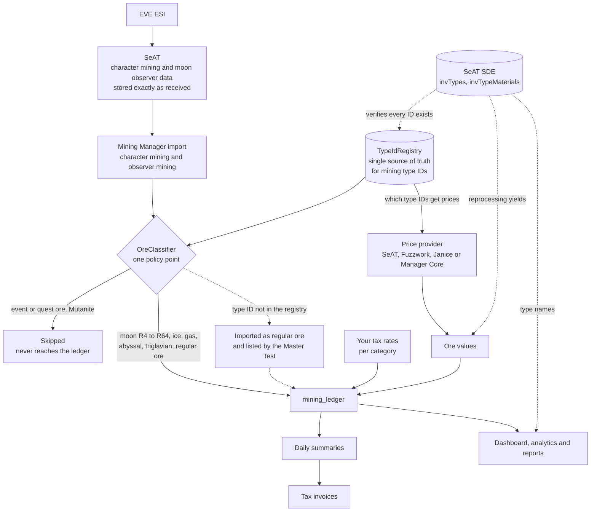

# Mining Manager for SeAT

[](https://packagist.org/packages/mattfalahe/mining-manager)
[](LICENSE)
[](https://github.com/eveseat/seat)

A comprehensive mining management plugin for SeAT 5.x. Track mining operations, manage moon extractions, calculate taxes, and generate detailed reports for your corporation.

## The Ecosystem Era

Mining Manager works on its own. Install it, set your Moon Owner Corporation, and everything below runs with no other plugins involved.

It also plays well with others. The idea behind the Ecosystem Era is that each plugin owns its own domain and *asks its neighbours* for what it does not own, instead of reimplementing them:

- **Manager Core** (optional) gives you one place to configure market pricing for every plugin, and a shared ESI fast-poll so moon notifications arrive in about two minutes instead of waiting on endpoint caches.
- **Structure Manager** (optional) publishes structure threat events, so a refinery running an extraction that is low on fuel or under attack raises an *Extraction at Risk* alert here, with a link straight to the Structure Board.

None of it is required. Every integration degrades to a clean no-op when the other plugin is absent, and the toggles that depend on it grey out so you can see why.

Release history lives in the [CHANGELOG](CHANGELOG.md).

## Features

- **Mining Ledger** -- Automated processing of character and corporation mining data with daily summary aggregation. Personal mining is imported as whole days: SeAT keeps a day mined in several sittings as several rows, and the import adds them up. The scheduled import reads the last two days by mining date, so mining SeAT saves later than that is left out and days already billed never change.
- **Moon Mining** -- Extraction tracking, ore composition, value estimation, jackpot detection (automatic + manual reporting), chunk arrival alerts. The **Extraction Calendar** shows three months at once as stacked per-month grids (week and list views a click away), each chunk badged with the tier of its moon worked out from that extraction's own ore, on EVE time. Past Extractions table with sortable/filterable DataTables view, structure column, status filter (expired/fractured/cancelled), and search — scoped to Moon Owner Corporation only
- **Moon Extraction Planner** *(Moon Manager / Director)* -- A corp-internal coordination calendar at **Moon Planner** for staggering refinery pulls so a small crew isn't drowned by chunks landing together (chunks not mined promptly are wasted). SeAT can only read in-game extractions, so the planner is intent/coordination only — it never controls the structure. Gated by the standalone `mining-manager.moon_manager` ability (directors/admins included), which also opens Moon Analytics.
  - **Three months at once** — the anchor month plus the next two as stacked grids, paged by prev/today/next, so a quarter (or a year, by paging) is visible in one place.
  - **Everything in EVE time (UTC)** — the clock EVE's in-game structure scheduler uses. The add/edit form takes EVE time and shows a live "that's *[time]* your local time" confirmation; locked entries show both.
  - **Auto-fill from history** — walks each refinery's cadence across the whole visible window (needs ≥2 past arrivals; median interval at ≥3) and places every occurrence not already covered by a real pull, an archived pull, or an existing plan. Refineries with too little history of their own fall back to the corp-median cadence (flagged as estimated). Spreads placements to honour the minimum gap.
  - **Re-anchor a recurring day** — move a Monday moon onto Tuesday and it sticks; future projections chain off the moved slot.
  - **Minimum-gap guard** — placing/moving a pull within the configurable gap (default 24h) of another arrival raises a confirmation listing the clashing moons, enforced client- **and** server-side.
  - **Locked in-game pulls** — live/completed extractions and plans reconciled to a real extraction are marked with a lock and can't be edited; clicking one explains why. Archived pulls stay visible so a refinery whose chunk already arrived doesn't vanish.
  - **30-minute dedup + off-plan detection** — a plan and the real pull within 30 min are the same pull (plan hidden, no double render). Further apart but same cycle means the in-game timer diverged: the pull is flagged red, listed in a **Scheduling mismatches** banner, and a `schedule_mismatch` notification fires. **Realign** moves the plan to the time the drill was actually set for in game; **Ignore** keeps the plan's time and records that the pull went ahead off-plan. Both ask for a reason, both are saved to the change history with who did it, and neither moves later plans for that refinery.
  - **Refinery panel** — every refinery with its cadence, last arrival, projected next pull, a **coverage badge** (`Planned 2×` / amber `Not planned` = skipped moon, counted across the whole horizon), and a **highest-ore-tier badge** (R4–R64). Uncovered refineries sort to the top.
  - **Blueprints** — a repeating pattern of pulls (which refinery, which weekday, what EVE time) over one to eight weeks, laid onto the planner from any start date for as many cycles as you ask for. Editing a blueprint carries the change to the pulls it already wrote, leaving anything already pulling or already past exactly as it was. Applying can instead take over the weeks it covers, clearing everything else planned in them first, including days the pattern does not use, with the full list of what goes shown before you confirm. One refinery per blueprint, picker labelled by moon tier, and refineries that have been unanchored or destroyed are flagged and cleared out by one button. A refinery being unanchored, or with its moon drill unfitted, keeps its slots and pulls under a yellow warning mark, since both can change back. Their planned pulls come off the calendar by themselves once the refinery has been missing on three sightings at least twelve hours apart, with a **Refinery Gone** notification for each.
  - **Moon tier on every pull** — the calendar carries the same R4–R64 badge as the refinery cards, with the full refinery name and moon on hover. Today is picked out in amber.
  - **Change history** — every create / move / delete / realign / ignore records who did it and the before→after times; auto-fill logs an aggregate entry. A **History** button shows the last 100 changes.
- **Extraction Simulator and Find Moons** -- Simulate any scanned moon over 6 to 56 days with ore value, refined value, class and a quality rating against the scanned moons of its class, all priced from the price cache. The simulator says so when the value on screen is not the one tax is worked out from. **Find Moons** *(Director / Moon Manager / Moon Finder)* searches every scanned moon by region, constellation, system, security band, class, moon ore share (the moon ores in the scan added together, not the whole scan), required ores, composition rules (R16 at least 20%), value range and quality, finds a single moon by name, marks the moons one of your refineries still sits on, the ones held by another corporation and the ones on your shared watchlist (any of which can be hidden), suggests better moons of the same class nearby, and exports the results to CSV.
- **Moon drilling rigs** -- A Moon Drilling Stability rig on an Athanor, or a Proficiency rig on a Tatara, stretches a chunk's mining window from 48 hours to 72 (Tech I) or 96 (Tech II), and Mining Manager follows it everywhere it times a chunk; the 2 hour unstable tail after it stays. Which rig a chunk had is read from the auto-fracture time EVE gave it, so it works for any refinery and a later rig swap never changes a chunk already pulled. Each extraction keeps the rigs seen in its refinery's rig slots, the extraction page shows them with roughly how much ore a yield rig (Efficiency or Proficiency) added, a chunk's ore figures follow the newest of the four game notices that report them, and the simulator lets you try any fit, starting from what is fitted.
- **Metenox Cargo Readout** *(v2.0.1, director-only)* -- New sidebar page showing what's currently in every Metenox Moon Drill's `MoonMaterialBay` owned by your **Moon Owner Corporation** (matches the Past Extractions table scope and the related notification). Per-drill cards with ore composition, quantity, m³ volume, percent-of-cargo bars, ISK valuation (Manager Core pricing primary, Jita/Fuzzwork fallback), structure state, **solar-system name** (joined from `solar_systems.name` with id-only fallback), and last-polled timestamp (yellow if stale > 2h). Per-drill **bay fill indicator** with color-graded progress bar (500,000 m³ Metenox MoonMaterialBay capacity, verified against SDE attribute 5693 and EVE Ref). **Admin scope picker** -- operators with `mining-manager.admin` get a dropdown above the chips listing every corp with at least one Metenox + an "All corps" aggregate option, defaulting to the same Moon Owner Corp view directors see (one-click "Back to Moon Owner" shortcut whenever off the default). Notifications still scope to Moon Owner Corp only, so admin's expanded read visibility doesn't generate extra alert traffic. **Cargo Bay Full notification** fires when a drill crosses the configurable fill threshold (default 85%, configurable 50-99%) — yield-stopping warning, dedup-latched against repeats while still over threshold, resets when cargo is pulled. Cron `mining-manager:scan-metenox-cargo-fill` every 5 min. Cross-plugin contract: PluginBridge capability `mining.metenox.cargoSnapshot($structureId)` lets Structure Manager render the bay on its structure detail page.
- **Tax System** -- Daily summary-based tax calculation with per-ore rates (moon R4-R64, regular ore, ice, gas, abyssal, triglavian), multi-corporation support, guest mining rates, event modifiers (per-row attribution), configurable minimum tax amount with exempt/enforce behavior, wallet payment verification, and manual payment entry. Supports **monthly** and **biweekly** tax periods with a safe queued-switch mechanism (effective day 3 of next month to prevent row collisions). Weekly period type removed in v2.0.0 &mdash; historical weekly rows still render correctly.
- **Payments and account balance** -- A wallet transfer is money looking for an invoice. Matching it by tax code is the fast path; where no code was quoted, a director can **assign a payment to an invoice** by hand in two clicks. Whatever a payment does not settle cascades onto the next unpaid invoice, oldest first, and anything left over is held as **account balance** against future ones. Every payment is claimed exactly once and each invoice it touches records its own slice, so an instalment can never be credited twice. Members can **pay ahead** with a standing keyword in the transfer reason (default `MM-UPFRONT`, configurable, off by default; both the keyword and the switch are global rather than per corporation, and labelled as such). A **Balances** tab shows a director everyone holding a balance and a member their own, alt-aware, each listing what it has been spent on. A **verification cutover** keeps payments from before the upgrade out of the queue, so an install does not wake to a backlog of historical transfers to re-examine. Directors can **refund** a held balance: it comes off the balance straight away, and the refund confirms itself when the transfer, sent in game with the refund keyword in the reason (default `MM-REFUND`), shows up in the corporation wallet. One that will never match can be marked sent by hand, with a note, and reads as such. While upfront payments are on, the Balances tab shows members how to pay ahead, and My Taxes tells members to right-click the corporation in game and choose Give Money.
- **Ore classification** -- `TypeIdRegistry` covers 540 type IDs, including the IV-Grade tier of all fifteen classic ores, the Exordium 0-Grade variants, the X-Grade families, Prismaticite, and the full gas colour sets. Classification changes apply from the moment the plugin is upgraded and no earlier: mining already in the ledger keeps the categories and rate it was billed on, and mining that arrives after its period has been invoiced is marked exempt and says so rather than being charged for silently. Event and quest ore (Tyranite, Nephrite, Volatile Ice and the rest of the limited-time and mission ore) and all six Mutanite types are not imported, taxed or charted. Mutanite comes from permanent Homefront Operations content, but it cannot be reprocessed and often has no price, so counted it only sat in the ledger as regular ore worth nothing. See [How Ore Classification Works](#how-ore-classification-works).
- **Mining Events** -- Create events with tax modifiers (tax-free to double-tax). Dedicated `event_mining_records` table materialises the exact mining activity qualifying for each event, with all four scope filters (corporation, location, time, ore category) applied at populate time. Per-row tax attribution: the modifier applies only to mining that actually overlaps the event window, not the whole day. Historical pricing preserved via proportional allocation from the mining ledger. Event form surfaces a live tax-compatibility panel so organisers know which event types are meaningful given current tax settings. *(v2.0.1)* Event create/edit forms gained an **EVE/UTC vs My local time** input toggle with live confirmation box; server still always stores UTC. Miners see their event discount ("saved X ISK") on My Mining and My Taxes; directors see an Event Tax column + 12-month chart.
- **Local time + live countdowns** *(v2.0.1)* -- Every server-rendered EVE timestamp gets a hover tooltip with full local time formatted in your browser's timezone (same mechanism Discord / Google Calendar / GitHub use; DST handled automatically). High-priority surfaces (active extractions, upcoming events, calendar, my-events) opt into an inline " · HH:MM local" pill for at-a-glance reading. `Carbon::diffForHumans()` text replaced with 1-second-tick countdowns color-graded from green (>1d) to red+bold (<1h) on the relevant pages. Browser-TZ readout in Help & Documentation lets operators sanity-check what their browser reports.
- **Reports** -- Daily/weekly/monthly reports with PDF/CSV/JSON export and scheduled Discord/Slack delivery
- **Theft Detection** -- Detect and monitor unauthorized mining with severity classification and incident tracking
- **Dashboard** -- Corporation-wide analytics with 12-month charts, leaderboards, and statistics
- **Analytics** *(Director; Moon Analytics also for Moon Managers)* -- Opens on your own corporation, with All Corporations as a deliberate second choice. **Performance Charts** filter by source (all mining, my moons only, all moon ore, other moons only), ore category and player (picked by main, counted across every character that player mines on), and exports carry the same filters. **Moon Analytics** covers utilization, pool vs mined, per-extraction detail and ore popularity. **Allow Data Export** (Settings > Features) switches every export and download off for everyone, directors and admins included; the settings backup stays available.
- **Notifications** -- 30 notification types via Discord webhooks, Slack, EVE Mail, or custom JSON endpoints, with per-webhook event toggles. Cross-plugin alerts for fuel/shield/armor/hull/destroyed events when Manager Core + Structure Manager are installed. Three new standalone moon-lifecycle notifications: **Extraction Started** (a refinery lit its drill, naming the pilot who started it and their main, read from the in-game `MoonminingExtractionStarted` director notification), **Next Extraction Planned** (fires *after* a chunk is ready, announcing the refinery's next planned pull from the planner so a director re-fires on schedule), and **Moon Scheduled Off-Plan** (the in-game timer diverged from the plan by more than the 30-minute tolerance — one ping per plan). Four more planner notifications: **Refinery Gone** (pulls taken off a refinery the corporation no longer owns, one message per refinery), **Moon Extraction Cancelled** (stopped in game before the chunk arrived, naming who), **Moon Not Rescheduled** (a drill left idle after its chunk arrived, repeating until an extraction starts) and **Moons Need Planning** (one list of refineries short of planned pulls, cut at 25 with the total). Only refineries with a moon drill fitted count, and both reminders leave out one that is gone, reported destroyed, or unanchoring with no extraction running. **Manager Core fast-poll** — when Manager Core is installed, Extraction Started is detected in ~2 min via MC's ESI fast-poll instead of the ~30 min moon-extraction endpoint cache; the two paths are mutually exclusive (no duplicates), with an operator `auto` / `seat_native` toggle. Without Manager Core the alert waits for the in-game notification to reach SeAT so it can name the pilot, and goes out without the name if six hours pass first. Directors can bind a weekly **Outstanding Mining Tax** digest of who still owes, and **Price Provider Trouble**, which says so once when price refreshes stop getting through and once when they work again. **Moon Scan Missing** lists the moons your refineries drill that have no scan in SeAT, which Mining Manager values from the game's notices until somebody scans them. The two sit in their own Plugin Health group, each with its own switch. *(v2.0.1)* Inline **Discord role picker** on every per-type role-id input (one-click pick from your installed Discord role source — SeAT Broadcast / SeAT Connector / legacy warlof tables). **Notification Routing Map** read-only Settings tab shows what fires where and who gets pinged at a glance, with "enabled but firing nowhere" warnings.
- **EventBus Publishing** *(v2.0.1)* -- Three new `mining.extraction_*` events published via Manager Core's Topics facade (`ready` / `unstable` / `expired`) once per extraction per lifecycle stage. Rich payload with deeplink URL. New cron `mining-manager:scan-extraction-events` at `*/5 * * * *`. Standalone-safe via `class_exists` guard on `\ManagerCore\Topics`. Consumable by SeAT Broadcast's FC Opportunities board.
- **Diagnostics** -- 16-tab diagnostic suite. *(v2.0.1)* Default tab is now **Health Checks** (renamed from "System Status", reordered so the universal tabs come first). Tier 1 tabs each open with a "What this tab does / When to use / Heads up" intro box. Tabs: Health Checks, Master Test (one-click read-only smoke chain, 39 checks, including payment reconciliation, invoices carrying their payment code, the moon value shown matching the value taxed, the payment and refund setup, the personal mining import, moon notifications reaching SeAT, ignored ore reaching the ledger and mined ore the registry does not recognise), System Validation, Settings Health, Data Integrity, Tax Trace, Notification Testing, plus plugin-specific traces and a DEV-only Test Data tab.

## Requirements

- SeAT 5.x
- PHP 8.1+
- MariaDB / MySQL

## Installation

```bash
composer require mattfalahe/mining-manager
php artisan migrate
php artisan db:seed --class=MiningManager\\Database\\Seeders\\ScheduleSeeder
```

After installation:

1. Open SeAT and navigate to **Mining Manager > Settings > General**
2. Set your **Moon Owner Corporation**
3. Configure tax rates in **Settings > Tax Rates**
4. Run the setup wizard to populate your data:

```bash
php artisan mining-manager:initialize
```

The wizard verifies your settings, populates current month data (prices, mining entries, summaries, extractions), and optionally backfills historical data for reports and analytics.

## Configuration

### Key Settings

| Setting | Location | Description |
|---|---|---|
| Moon Owner Corporation | Settings > General | Which corporation owns the moon structures -- determines observer data scope |
| Tax Rates | Settings > Tax Rates | Per-corporation rates for moon ore (R4-R64), regular ore, ice, gas, abyssal, triglavian. Period type (monthly / biweekly) and the queued-switch safeguard configured here too. |
| Guest Miner Tax Rates | Settings > General | Global rates for non-member miners on your moons (0% = no tax) |
| Tax Selector | Settings > Tax Rates | Choose what ore types to tax (all moon ore / only corp moon ore / none + regular types) |
| Price Provider | Settings > Pricing | Market data source (SeAT, Fuzzwork, Janice, or Manager Core) |

### Corporation Tax Model

| Miner Type | Data Source | Tax Rate Applied |
|---|---|---|
| Member of configured corp | Moon observer + character ledger | That corp's tax rates |
| Guest miner (not in any configured corp) | Moon observer only | Guest tax rates (from General Settings) |
| Non-member mining elsewhere | Not processed | Not taxed |

### Moon Arrival Notification Architecture

Moon arrival notifications use two decoupled systems:

```
┌──────────────────────────────────────────────────────────────────┐
│  STATE SYSTEM (ESI-driven)                                       │
│  - update-extractions every 2h                                   │
│  - Pulls ESI and writes chunk_arrival_time, natural_decay_time,  │
│    fractured_at, status                                          │
│  - Answers: "what does EVE say is happening?"                    │
└──────────────────────────────────────────────────────────────────┘

┌──────────────────────────────────────────────────────────────────┐
│  NOTIFICATION SYSTEM (time-driven)                               │
│  - check-extraction-arrivals every 1 min                         │
│  - Reads stored chunk_arrival_time, compares to now()            │
│  - Answers: "has arrival time passed + unnotified?"              │
│  - Idempotent via notification_sent flag                         │
└──────────────────────────────────────────────────────────────────┘
```

**ESI tells us WHAT is happening. The clock tells us WHEN to notify.**

This decoupling means arrivals notify within ~60 seconds of the actual chunk arrival time regardless of ESI refresh timing or outages. The chunk_arrival_time is known the moment an extraction is first imported (days or weeks before arrival); the notification watchdog just compares it to the current time.

**Cancellation handling:** If a director cancels an extraction in-game before chunk arrival, EVE sends a `MoonminingExtractionCancelled` character notification. The state system detects this during its next ESI poll and marks the extraction as `cancelled`. The notification watchdog then skips it — no false "Moon Chunk Ready" alert fires at the originally scheduled arrival time.

**Extraction Started, fast-poll vs SeAT-native:** The `extraction_started` notification has two possible trigger paths. With **Manager Core** installed, MM registers a handler with MC's ESI fast-poll registry and reacts to the in-game `MoonminingExtractionStarted` director notification in ~2 minutes. That notification carries the pilot who started the extraction, so the alert names them, with their main when they are on SeAT. Without Manager Core, the SeAT-native pass in `check-extraction-arrivals` picks the extraction up from the stored `extraction_start_time`, then holds the alert until the `MoonminingExtractionStarted` notification reaches SeAT so it can name the pilot the same way. It looks again every 10 minutes, and if the notification still has not arrived six hours after the extraction started, the alert goes out without the name: a slow notification can delay the alert but never lose it. The two paths are **mutually exclusive**: when fast-poll is active the SeAT-native pass is suppressed, so a single notification fires per extraction. Operator toggle at Settings → Notifications → *Extraction Started — Detection Speed* (`auto` / `seat_native`, default `auto`). Same model Structure Manager uses for its structure alerts.

### How Ore Classification Works

Every row in the mining ledger carries an ore category, and the category decides which of your tax rates applies. It is decided once, when mining is imported, the same way for character mining and for moon observer data.



| Part | Role |
|---|---|
| **`TypeIdRegistry`** | The single source of truth: every type ID the plugin knows, grouped by family (moon ore by rarity, ice, gas, abyssal, triglavian, regular ore, the compressed forms, event and quest ore, Mutanite). Data only, no rules, and the one place to update when CCP releases new ore. |
| **`OreClassifier`** | The one policy point: whether a type is skipped, and which ledger category and tax category it gets. Both importers, the mining event tally, daily summaries, tax calculation, the dashboard and analytics all ask it, so they cannot disagree. |
| **SeAT's SDE** | Support only: type names, reprocessing yields for refined ore values and the reprocessing calculator, and `mining-manager:diagnose-type-ids --verify-db` to check every registry ID exists. It never decides a category, because moon rarity tiers and tax categories are Mining Manager ideas and CCP's own groups do not line up with them. |

| Ledger category | Covers | Tax rate used |
|---|---|---|
| `moon_r4` to `moon_r64` | Moon ore, by rarity | The moon ore rate for that rarity |
| `ice` | Ice and compressed ice | Ice |
| `gas` | Harvested gas, fullerites included | Gas |
| `abyssal` | Bezdnacine, Rakovene and Talassonite | Abyssal ore |
| `triglavian` | The registry's Triglavian ore list | Triglavian ore |
| `ore` | Every other registered ore, including the Deep Space Survey and Ore Prospecting Array families | Regular ore |

The tax selector under Settings > Tax Rates decides which of those categories are charged at all.

**Left out entirely:** event and quest ore (Tyranite, Nephrite, Dense Moissanite, Amethystic Crystallite, Hiemal Tricarboxyl Condensate, Volatile Ice, Veldspar Isotope) and all six Mutanite types (`77118`, `77418` to `77421`, `77524`). They are skipped at import and count towards no mining event.

**Types the registry does not know** are imported as regular ore rather than skipped. The imports only read recent days, so mining skipped while the registry was behind could never be brought back. The Master Test's *Unrecognised ore types* check lists any such type mined in the last 30 days, with its name from the SDE, so it can be added.

**History is never reclassified.** Classification changes apply from the moment you update: mining already in the ledger keeps the category and rate it was imported with, and invoices already issued never change. `mining-manager:backfill-ore-types` stops at that cutover by default.

## Permissions

4-tier permission model -- higher tiers inherit all lower tier access. Plus two standalone capabilities: `moon_manager` grants the planner, Moon Analytics and Find Moons without requiring full director, and `moon_finder` grants Find Moons on its own.

| Permission | Tier | Description |
|---|---|---|
| `mining-manager.view` | Base | Help page access |
| `mining-manager.member` | Member | View own mining data, join events, view moon schedules, report jackpots, reprocessing calculator |
| `mining-manager.director` | Director | View all corp data, manage operations, analytics, reports, theft detection |
| `mining-manager.admin` | Admin | Full control: settings, tax management, delete actions, API, diagnostics |
| `mining-manager.moon_manager` | Capability *(standalone)* | Access the Moon Extraction Planner (assign / move / auto-fill planned moon pulls, realign or ignore an off-plan pull), Moon Analytics and Find Moons. Directors and admins also have this access. |
| `mining-manager.moon_finder` | Capability *(standalone)* | Find Moons on the Extraction Simulator: search every scanned moon by location, composition, value and quality. Directors and moon managers also have this access. |

## Artisan Commands

38 commands available, 26 run on automated schedules via SeAT's scheduler.

### Operational Commands

| Command | Schedule | Description |
|---|---|---|
| `mining-manager:process-ledger` | Every 30min (:15, :45) | Process corporation observer mining data |
| `mining-manager:import-character-mining` | Every 30min (:20, :50) | Import character mining from SeAT's ESI data, adding up the rows SeAT keeps for each day. Scheduled with `--days=2` by mining date, so mining SeAT saves later is left out and billed days stay put. `--dry-run` shows what it would add or change without writing anything |
| `mining-manager:update-extractions` | Every 2h | Refresh moon extraction data from ESI (state system: what EVE says is happening) |
| `mining-manager:check-extraction-arrivals` | Every minute | Fire moon_arrival notifications based on stored chunk_arrival_time (notification system: when to notify). Idempotent via notification_sent flag |
| `mining-manager:update-events` | Every minute | Auto-transition event status (planned→active→completed) with notifications, update participant data |
| `mining-manager:cache-prices` | Every 4h (:30) | Cache market prices from configured provider |
| `mining-manager:update-ledger-prices` | Daily 1:00 AM | Lock in daily session prices for mining entries |
| `mining-manager:update-daily-summaries` | Daily 1:30 AM | Safety net for non-observer mining data |
| `mining-manager:calculate-taxes` | Daily 2:15 AM | Update running month-to-date tax totals |
| `mining-manager:generate-invoices` | Daily 2:30 AM | Generate tax invoices for completed periods with automatic tax code assignment |
| `mining-manager:verify-payments` | Every 6h (:05) | Match wallet transfers against tax codes and the upfront keyword, and confirm refunds once the ISK has left the corporation wallet |
| `mining-manager:send-reminders` | Daily 10:00 AM | Send tax payment reminders (if enabled in settings) |
| `mining-manager:generate-reports` | Day 9 of month 4:05 AM + hourly (scheduled) | Generate monthly report (7 days after finalize-month for collection % to mature) and process user-defined scheduled reports. Dedup guard skips if same period+type exists (use `--force` to override) |
| `mining-manager:recalculate-extraction-values` | Twice daily (6AM/6PM) | Update moon extraction values with current prices |
| `mining-manager:archive-extractions` | Daily 5:05 AM | Archive completed extractions older than 7 days |
| `mining-manager:detect-jackpots` | Daily 6:05 AM | Detect jackpot extractions + verify manual reports |
| `mining-manager:send-outstanding-digest` | Daily 10:30 AM | Reminds directors who is still outstanding, every 7 days, with names, what each still owes and how far through they are |
| `mining-manager:validate-lifecycle-integrity` | Daily 3:00 AM | Warns when a stored extraction status has drifted from what the lifecycle helpers compute; `--fix` corrects it |
| `mining-manager:detect-theft` | 1st and 15th 1:00 AM | Full scan for unauthorized moon mining |
| `mining-manager:monitor-active-thefts` | Every 6h (:10) | Monitor characters already on theft list |
| `mining-manager:finalize-month` | 2nd of month 2:00 AM | Pre-calculate summaries for closed month |
| `mining-manager:calculate-monthly-stats` | 2nd of month 3:00 AM + every 30min (current month) | Dashboard statistics |

### Utility Commands

| Command | Description |
|---|---|
| `mining-manager:initialize` | Guided first-time setup wizard -- verifies settings, populates current month, optional historical backfill |
| `mining-manager:backfill-ore-types` | Re-stamp ore classification flags on existing ledger rows. Defaults to `--scope=epoch`, which stops at the classification cutover so mining already billed keeps the categories it was billed on; `--scope=all` overrides that deliberately. `--dry-run` reports every category movement first, since each one is a change of tax rate |
| `mining-manager:backfill-extraction-notifications` | Backfill fractured_at from historical ESI notifications |
| `mining-manager:backfill-extraction-history` | Reconstruct moon_extraction_history from `MoonminingExtractionStarted` notifications. Recovers past cycles for structures that pre-date plugin install. Progress bars for both dedup and processing passes. Use `--dry-run` to preview, `--structure=ID` to scope to one structure. Automatically invoked during `mining-manager:initialize` (Phase 3 historical backfill) |
| `mining-manager:generate-tax-codes` | Mint payment codes for any tax record missing one. Codes are normally minted when the record is created, so this is the fallback for older records and for anything that failed at the time |
| `mining-manager:backfill-event-records` | One-off population of `event_mining_records` for events that pre-date the table |
| `mining-manager:generate-test-data` | Generate test data for development/testing |
| `mining-manager:backup-data` | Export Mining Manager data for backup or migration |
| `mining-manager:restore-data` | Import Mining Manager data from a backup |
| `mining-manager:diagnose-prices` | Diagnose price cache health and market data |
| `mining-manager:diagnose-affiliation` | Debug character corporation affiliations |
| `mining-manager:diagnose-character` | Debug character mining data and imports |
| `mining-manager:diagnose-extractions` | Debug moon extraction data and notifications |
| `mining-manager:diagnose-type-ids` | Debug ore type ID classification |

## Webhook Notifications

26 notification types across 6 categories (plus 3 cross-plugin / Metenox types: extraction-at-risk, extraction-lost, metenox-cargo-full, documented elsewhere). Each webhook can independently toggle which events it receives.

Supported channels: Discord webhooks, Slack, and ESI in-game mail (for tax reminders/invoices/overdue notices).

| Category | Events | Description |
|---|---|---|
| Tax | generated, announcement, reminder, invoice, overdue, outstanding-digest | Payment lifecycle notifications, plus a weekly digest for directors of who still owes |
| Moon | arrival, jackpot, chunk-unstable, extraction-started, next-planned, schedule-mismatch, refinery-gone, extraction-cancelled, not-rescheduled, needs-planning | Chunk ready, jackpot detection, capital safety warnings (~2h before chunk goes unstable), drill lit (Extraction Started, naming who started it), the planner's next-pull nudge (Next Extraction Planned), off-plan scheduling alerts (Moon Scheduled Off-Plan), pulls removed from a refinery that is gone (Refinery Gone), extractions stopped in game (Moon Extraction Cancelled), idle drills (Moon Not Rescheduled) and refineries short of planned pulls (Moons Need Planning) |
| Events | created, started, completed | Mining event lifecycle |
| Theft | detected, critical, active, resolved | Security alerts |
| Reports | generated | Scheduled report delivery |
| Plugin Health | price-provider, moon-scan-missing | Price refreshes failing or working again (Price Provider Trouble), and moons your refineries drill with no scan in SeAT, valued from the game's notices until they are scanned (Moon Scan Missing) |

All dispatch goes through a single `NotificationService` (consolidated from the previous two-dispatcher design) with 5xx/429 retry, per-type master toggles, per-channel filters, and per-webhook subscription gating. Webhooks are routable to the Tax Program Corporation (moon/theft/tax) or global (events/reports).

### Diagnostic Testing

**Mining Manager → Diagnostic → Notification Testing** provides three test modes for verifying webhook configuration:

| Mode | Scope | Purpose |
|---|---|---|
| **Preview Test** | One webhook (selected or custom URL) | Check embed layout + single-webhook wiring — renders without writing to audit log |
| **Fire Live Notification** | Full pipeline, one type, all subscribed webhooks | End-to-end verification for one specific surface. Respects corp scoping + all gates. Writes audit log. |
| **Fire ALL (Chain)** | Full pipeline, every fire-able type sequentially | Post-deploy smoke test — every subscribed webhook receives every type in well under a minute |

Settings → Webhooks → **Test** button sends a minimal "✅ Webhook Active" ping for wiring verification.

## Support

- **Issues**: [GitHub Issues](https://github.com/MattFalahe/Mining-Manager/issues)
- **Wiki**: [Documentation & Screenshots](https://github.com/MattFalahe/Mining-Manager/wiki)
- **In-App Help**: Full documentation available at Settings > Help within the plugin

## License

GNU General Public License v2.0 -- see [LICENSE](LICENSE) for details.

---

*EVE Online and the EVE logo are the registered trademarks of CCP hf. All rights are reserved worldwide.*
